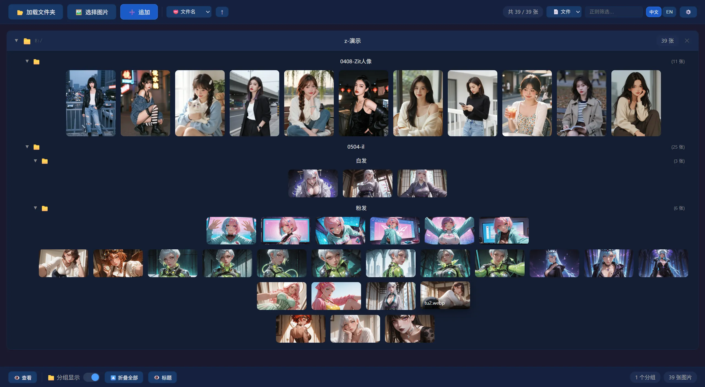

# 格图A - 图片分组浏览器

# 核心功能
分组网格视图：
1. 以文件夹作为分组；或可手动创建临时分组；
2. 每组以网格视图组织；
3. 多组集合查看
# 其他功能
对比功能
1. 可选择两张图片进行对比

筛选功能
1. 可按文件名、分组、路径 进行筛选；
2. 可保存为预设

## 文档

详见 [docs/](./docs/) 目录：

- [功能手册](./docs/features.md) — 所有功能说明与操作指引
- [系统架构](./docs/architecture.md) — 技术栈、项目结构、架构图、数据流
- [Rust 后端](./docs/backend.md) — Tauri 命令、数据结构、图片加载流程
- [Vue 前端](./docs/frontend.md) — 组件逻辑、状态管理、树构建、视图组成

## 技术栈

| 层       | 技术                          |
| -------- | ----------------------------- |
| 桌面框架 | Tauri 2                       |
| 前端     | Vue 3 + TypeScript + Vite 6   |
| 后端     | Rust                          |
| 对话框  | tauri-plugin-dialog           |
| 图片编码 | base64                        |
